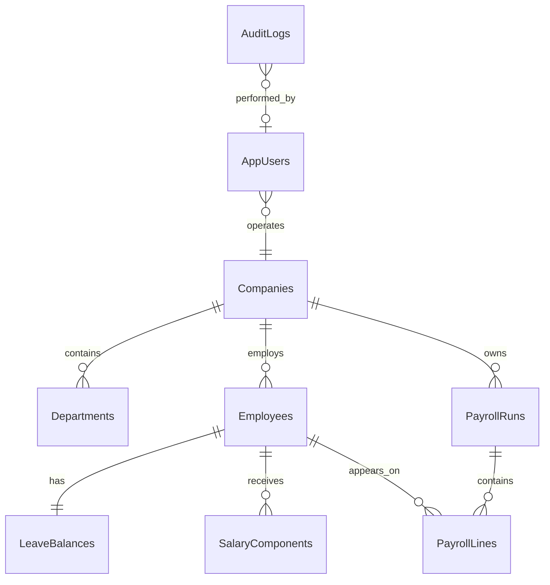

# PayBridge ER Overview

The checked-in [ERDiagram.png](/c:/WorkSpace/Payroll/Payroll/Docs/ERDiagram.png) is a placeholder image so the repository shape matches the requested deliverables. Use this markdown as the editable source for generating a richer diagram later.
